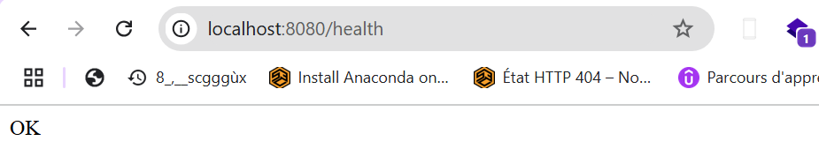

# Assignment-2

This project is a Spring Boot application with Docker support. 
It includes a basic setup project and display Healt toure that return OK.

---

## Setup Instructions

### Prerequisites
Ensure the following are installed on your system:
- [Java 23](https://www.oracle.com/java/technologies/javase-downloads.html)
- [Docker](https://www.docker.com/products/docker-desktop/)
- [Gradle](https://gradle.org/install/)

### Steps to Run the Application

1. **Clone the Repository**  
   Clone this repository to your local machine:
   ```bash
   https://github.com/saliou-tech/ednova-assignments.git
   cd assignment-2

2. **Build the Application**
   ```bash
   ./gradlew build

3 **Run the docker compose**
   ```bash
    docker-compose -f dependencies/docker-compose.yml up
   ```
  

3 **Start the appliaction**
   ```bash
   ./gradlew bootRun
   ```

  
####  Resultat



   